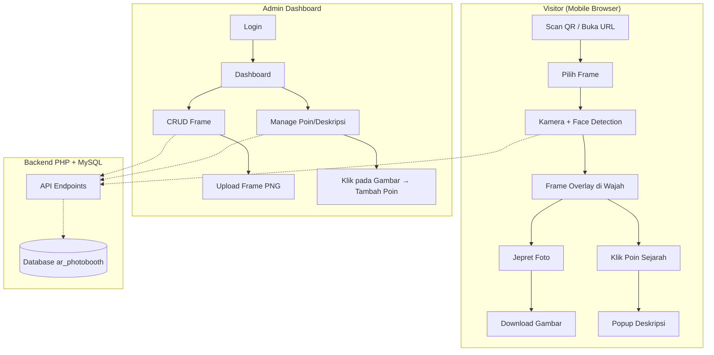

# AR Photo Booth & Frame System — Kafe Merah Putih

Sistem AR Photo Booth berbasis web untuk pengunjung kafe. Pengunjung scan QR → pilih frame → kamera mendeteksi wajah → frame overlay muncul → jepret foto → download. Admin dapat mengelola frame dan menambahkan "poin sejarah" interaktif pada elemen frame.

## User Review Required

> [!IMPORTANT]
> **Face Detection Approach**: Saya akan menggunakan **MediaPipe Face Detection** (by Google) — library paling modern dan terawat untuk deteksi wajah di browser. Library ini gratis, cepat, dan bekerja langsung di browser tanpa server-side processing.

> [!IMPORTANT]
> **Database**: Sistem akan menggunakan **MySQL** via WAMP. Perlu dibuat database baru `ar_photobooth` dengan tabel untuk frames, points, dan admin users.

> [!WARNING]
> **HTTPS Requirement**: Akses kamera (`getUserMedia`) membutuhkan HTTPS atau localhost. Selama development di localhost WAMP tidak masalah, tapi saat hosting nanti **wajib HTTPS**.

## Open Questions

> [!IMPORTANT]
> 1. **Login Admin**: Apakah cukup dengan satu akun admin saja (username + password hardcoded/sederhana), atau perlu multi-user admin dengan role management?
> 2. **Frame Upload**: Frame yang sudah ada (Frame1.png, Frame2.png, Frame3.png) — apakah ini yang akan digunakan sebagai data awal? Apakah admin akan upload frame baru dalam format PNG dengan area transparan di tengah?
> 3. **QR Code**: Apakah perlu auto-generate QR code untuk setiap frame, atau QR code dibuat manual di luar sistem?

---

## Proposed Changes

### Arsitektur Sistem



---

### 1. Database

#### [NEW] [database.sql](file:///c:/wamp64/www/AR%20Techno/database.sql)

Membuat database `ar_photobooth` dengan tabel:

| Tabel | Kolom | Keterangan |
|-------|-------|-----------|
| `admin_users` | id, username, password (hashed), created_at | Akun admin |
| `frames` | id, name, description, image_path, is_active, sort_order, created_at, updated_at | Data frame |
| `frame_points` | id, frame_id, x_percent, y_percent, title, description, created_at | Poin interaktif pada frame |

---

### 2. Backend PHP — Config & Helpers

#### [NEW] [config/database.php](file:///c:/wamp64/www/AR%20Techno/config/database.php)
Koneksi database PDO ke MySQL.

#### [NEW] [config/auth.php](file:///c:/wamp64/www/AR%20Techno/config/auth.php)
Helper untuk session-based authentication admin.

---

### 3. Backend PHP — API Endpoints

#### [NEW] [api/frames.php](file:///c:/wamp64/www/AR%20Techno/api/frames.php)
- `GET` — List semua frame aktif (untuk visitor) atau semua frame (untuk admin)
- `POST` — Tambah frame baru (admin only, dengan file upload)
- `PUT` — Update frame (admin only)
- `DELETE` — Hapus frame (admin only)

#### [NEW] [api/points.php](file:///c:/wamp64/www/AR%20Techno/api/points.php)
- `GET ?frame_id=X` — List semua poin untuk frame tertentu
- `POST` — Tambah poin baru (admin only)
- `PUT` — Update poin (admin only)
- `DELETE` — Hapus poin (admin only)

#### [NEW] [api/auth.php](file:///c:/wamp64/www/AR%20Techno/api/auth.php)
- `POST` — Login admin (username + password)
- `DELETE` — Logout admin

#### [NEW] [api/upload.php](file:///c:/wamp64/www/AR%20Techno/api/upload.php)
- Handle upload file frame PNG

---

### 4. Frontend — Visitor (Mobile-First)

#### [NEW] [index.html](file:///c:/wamp64/www/AR%20Techno/index.html)
Halaman utama pengunjung dengan layout mobile-first:

**Layout:**
```
┌─────────────────────┐
│   AR Photo Booth    │  ← Header kecil
├─────────────────────┤
│                     │
│   ┌─────────────┐   │
│   │             │   │
│   │  KAMERA     │   │
│   │  3:4 RATIO  │   │
│   │  + FRAME    │   │
│   │  OVERLAY    │   │
│   │             │   │
│   └─────────────┘   │
│                     │
├─────────────────────┤
│ [📷] [🔄] [🖼️]     │  ← Tombol: Jepret, Flip Camera, Pilih Frame
└─────────────────────┘
```

**Fitur:**
- Video feed dari kamera dalam container 3:4
- Canvas overlay untuk menggambar frame di atas video
- Face detection menggunakan MediaPipe → frame diposisikan agar wajah berada di center area transparan frame
- Tombol **Jepret** (📷): Capture canvas → auto download sebagai JPG
- Tombol **Flip Camera** (🔄): Toggle depan/belakang
- Tombol **Pilih Frame** (🖼️): Bottom sheet popup dengan gallery frame
- Poin interaktif: Marker kecil pada frame yang bisa di-tap untuk lihat deskripsi sejarah

#### [NEW] [css/visitor.css](file:///c:/wamp64/www/AR%20Techno/css/visitor.css)
Styling mobile-first untuk halaman visitor:
- Dark theme dengan aksen merah-putih sesuai tema
- Fullscreen feel, minimal chrome
- Bottom sheet animation untuk pemilihan frame
- Smooth transitions dan micro-animations
- Safe area support untuk notch/home indicator

#### [NEW] [js/camera.js](file:///c:/wamp64/www/AR%20Techno/js/camera.js)
Modul kamera:
- Initialize getUserMedia dengan facingMode
- Switch front/back camera
- Handle permissions dan error states

#### [NEW] [js/face-detector.js](file:///c:/wamp64/www/AR%20Techno/js/face-detector.js)
Modul face detection:
- Load MediaPipe Face Detection via CDN
- Detect face dari video stream
- Return bounding box + keypoints wajah
- Smooth tracking (mengurangi jitter)

#### [NEW] [js/frame-renderer.js](file:///c:/wamp64/www/AR%20Techno/js/frame-renderer.js)
Modul rendering frame:
- Load frame image
- Hitung posisi frame berdasarkan posisi wajah terdeteksi
- Render frame overlay pada canvas
- Render poin interaktif (marker dots)

#### [NEW] [js/photo-capture.js](file:///c:/wamp64/www/AR%20Techno/js/photo-capture.js)
Modul capture foto:
- Gabungkan video frame + overlay frame ke satu canvas
- Convert ke blob/data URL
- Trigger download otomatis
- Flash animation effect

#### [NEW] [js/app.js](file:///c:/wamp64/www/AR%20Techno/js/app.js)
Main application yang mengikat semua modul:
- Initialize semua komponen
- Event listeners
- Frame selection logic
- Poin description popup

---

### 5. Frontend — Admin Dashboard

#### [NEW] [admin/index.html](file:///c:/wamp64/www/AR%20Techno/admin/index.html)
Halaman login admin.

#### [NEW] [admin/dashboard.html](file:///c:/wamp64/www/AR%20Techno/admin/dashboard.html)
Dashboard admin dengan fitur:

**Layout:**
```
┌──────────────────────────────────────────┐
│  🏛️ AR Photo Booth — Admin Dashboard    │
├────────┬─────────────────────────────────┤
│        │                                 │
│ Menu:  │   Content Area:                 │
│        │                                 │
│ • Dash │   - Stats overview              │
│ • Frame│   - Frame CRUD table            │
│ • Poin │   - Frame upload form           │
│        │   - Poin editor (klik gambar)   │
│        │                                 │
└────────┴─────────────────────────────────┘
```

**Fitur:**
- **Dashboard**: Statistik jumlah frame, poin total
- **Manage Frame**: Tabel CRUD — tambah, edit, hapus, toggle aktif/nonaktif, atur urutan
- **Manage Poin**: Pilih frame → tampilkan gambar frame → klik pada gambar untuk menambahkan poin → isi title & deskripsi sejarah → poin tersimpan dengan koordinat x%, y%
- Upload frame baru (drag & drop atau file picker)

#### [NEW] [admin/css/admin.css](file:///c:/wamp64/www/AR%20Techno/admin/css/admin.css)
Styling admin dashboard:
- Clean, modern dashboard design
- Sidebar navigation
- Card-based layout
- Modal untuk form input
- Responsive (tapi prioritas desktop)

#### [NEW] [admin/js/admin.js](file:///c:/wamp64/www/AR%20Techno/admin/js/admin.js)
JavaScript admin:
- CRUD operations via fetch API
- Frame upload handling
- Interactive point placement (click on image → save coordinates)
- Point editor with drag & preview

---

### 6. Assets

#### [EXISTING] Frame images
File frame yang sudah ada (`Frame1.png`, `Frame2.png`, `Frame3.png`) akan dipindahkan ke:

#### [NEW] [uploads/frames/](file:///c:/wamp64/www/AR%20Techno/uploads/frames/)
Direktori untuk menyimpan file frame yang diupload admin. Frame yang sudah ada akan di-copy ke sini dan di-seed ke database.

---

## Struktur Direktori Final

```
AR Techno/
├── index.html              ← Halaman visitor (AR camera)
├── database.sql            ← Schema database
├── config/
│   ├── database.php        ← Koneksi DB
│   └── auth.php            ← Auth helper
├── api/
│   ├── frames.php          ← API CRUD frames
│   ├── points.php          ← API CRUD points
│   ├── auth.php            ← API login/logout
│   └── upload.php          ← File upload handler
├── css/
│   └── visitor.css         ← Styling visitor
├── js/
│   ├── app.js              ← Main app
│   ├── camera.js           ← Camera module
│   ├── face-detector.js    ← Face detection
│   ├── frame-renderer.js   ← Frame rendering
│   └── photo-capture.js    ← Photo capture
├── admin/
│   ├── index.html          ← Login page
│   ├── dashboard.html      ← Admin dashboard
│   ├── css/
│   │   └── admin.css       ← Admin styling
│   └── js/
│       └── admin.js        ← Admin JavaScript
├── uploads/
│   └── frames/             ← Uploaded frame images
├── Frame1.png              ← Existing frames (akan di-seed)
├── Frame2.png
├── Frame3.png
└── ...
```

---

## Verification Plan

### Automated Tests
1. **Database**: Jalankan `database.sql` di MySQL dan verifikasi tabel terbuat
2. **API Testing**: Test setiap endpoint API via browser/curl
3. **Camera**: Test akses kamera di browser (Chrome localhost)
4. **Face Detection**: Verifikasi MediaPipe detect wajah secara real-time
5. **Frame Overlay**: Pastikan frame ter-render di atas video dengan posisi wajah sebagai center

### Manual Verification
1. **Flow Visitor**: Buka di mobile browser → pilih frame → arahkan kamera ke wajah → frame muncul → jepret → foto terdownload
2. **Flow Admin**: Login → tambah frame → tambah poin pada frame → verifikasi poin muncul di visitor view
3. **Responsiveness**: Test di berbagai ukuran layar mobile
4. **Camera Switch**: Test toggle kamera depan/belakang
